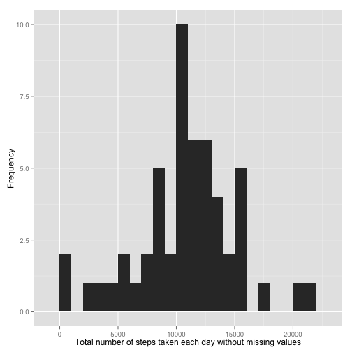
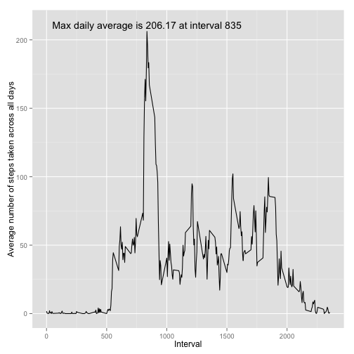
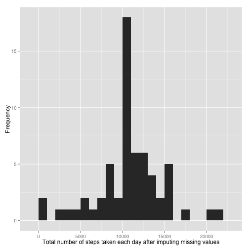
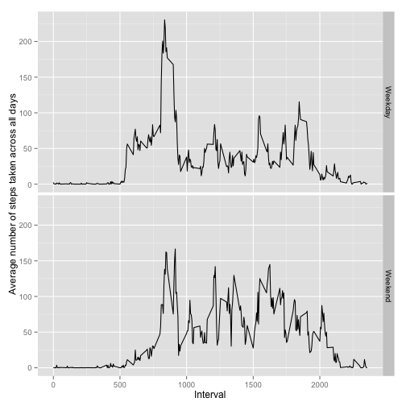

# Reproducible Research: Peer Assessment 1


## Loading and preprocessing the data

```r
activity <- read.csv("activity.csv")
activity$date <- as.Date(activity$date, "%Y-%m-%d")
```


## What is mean total number of steps taken per day?

```r
library(data.table)
library(ggplot2)
activity.dt <-data.table(activity[!is.na(activity$steps),])
activity.dt.summary <- activity.dt[, list(total=sum(steps)), by="date"]
p <- qplot(total, data=activity.dt.summary, binwidth=1000) 
p + labs(x="Total number of steps taken each day without missing values",
         y="Frequency")
```

 

```r
cat("The mean total number of steps taken per day without missing values:", 
    mean(activity.dt.summary$total),
    "\n")
```

```
## The mean total number of steps taken per day without missing values: 10766
```

```r
cat("The median total number of steps taken per day without missing values:", 
    median(activity.dt.summary$total),
    "\n")
```

```
## The median total number of steps taken per day without missing values: 10765
```


## What is the average daily activity pattern?

```r
activity.dt.summary <- activity.dt[, list(average=mean(steps)), by="interval"]
pos.x <- activity.dt.summary[which.max(activity.dt.summary$average),]$interval
pos.y <- round(max(activity.dt.summary$average), 2)
p <- qplot(interval, average, data=activity.dt.summary, geom=c("line")) 
p + labs(x="Interval",
         y="Average number of steps taken across all days") + 
  annotate("text", 
           x = pos.x, y = pos.y+5, 
           label = paste("Max daily average is", pos.y, "at interval", pos.x),
          )
```

 

```r
cat("The identifer of the 5-minute interval that,",
    "on average across all the days in the dataset,",
    "contains the maximum number of steps:",
    pos.x,
    "\n")
```

```
## The identifer of the 5-minute interval that, on average across all the days in the dataset, contains the maximum number of steps: 835
```


## Imputing missing values

```r
# Calculate and report the total number of missing values
# in the dataset (i.e. the total number of rows with NAs)
is.missing <- is.na(activity$steps)
cat("The total number of missing values in the dataset:", sum(is.missing), "\n")
```

```
## The total number of missing values in the dataset: 2304
```

```r
# Using the mean for that 5-minute interval to fit missing values
filling.average <- c()
for (i in seq_along(is.missing)){
  if (is.missing[i]){
    current_interval <- activity[i,]$interval
    current_average <- activity.dt.summary[
      activity.dt.summary$interval==current_interval, ]$average
    filling.average <- c(filling.average, current_average)
  }
}

# Create a new dataset that is equal to the original dataset 
# but with the missing data filled in.
activity.imputed <- activity
activity.imputed[is.missing, ]$steps <- filling.average

# Make a histogram of the total number of steps taken each day
activity.imputed.dt <-data.table(activity.imputed)
activity.imputed.dt.summary <- activity.imputed.dt[, list(total=sum(steps)),
                                                   by="date"]
p <- qplot(total, data=activity.imputed.dt.summary, binwidth=1000) 
p + labs(x="Total number of steps taken each day after imputing missing values",
         y="Frequency")
```

 

```r
cat("The mean total number of steps taken per day after imputing missing values:", 
    mean(activity.imputed.dt.summary$total),
    "\n")
```

```
## The mean total number of steps taken per day after imputing missing values: 10766
```

```r
cat("The median total number of steps taken per day after imputing missing values:", 
    median(activity.imputed.dt.summary$total),
    "\n")
```

```
## The median total number of steps taken per day after imputing missing values: 10766
```

The mean is same as the estimate from the first part, while the median increases
1 from the estiamte from the first part. The imputing missing data make the
mode of the total daily number of steps have higher frequency.


## Are there differences in activity patterns between weekdays and weekends?

```r
# Create a new factor variable in the dataset with two levels 
# -- "weekday" and "weekend" indicating whether a given date 
# is a weekday or weekend day.
activity.imputed.dt.pattern <- activity.imputed.dt[, list(steps=steps,
                                                          interval=interval,
                                                          weekday=weekdays(date)
                                                          )
                                                   ]
activity.imputed.dt.pattern$weekday <- as.factor(
  ifelse(activity.imputed.dt.pattern$weekday %in% c("Saturday","Sunday"),
         "Weekend", "Weekday")) 
activity.imputed.dt.pattern <- activity.imputed.dt.pattern[, 
                                                            list(
                                                            average=mean(steps),
                                                            interval=interval,
                                                            weekday=weekday
                                                            ),
                                                            by="interval,weekday"
                                                          ]

# Make a panel plot containing a time series plot (i.e. type = "l") 
# of the 5-minute interval (x-axis) and the average number of steps taken, 
# averaged across all weekday days or weekend days (y-axis).
p <- qplot(interval, average, data=activity.imputed.dt.pattern, 
           facets=weekday~., geom=c("line")) 
p + labs(x="Interval",
         y="Average number of steps taken across all days")
```

 

